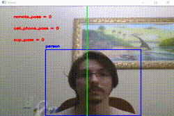

# TRAINNER 2020 LAPISCO - LISTA OBJECT DETECTION - DEEP LEARNING
#### Repositório contendo arquivos de uma questão resolvida do treinamento de detecção de objetos utilizando Darknet e Yolov4.
 

## Descrição da questão 🤓
Questão 2 - Utilize um peso já treinado da Yolo que contenha a classe Xícara (cup), Controle Remoto (remote) e Celular (cellphone).
 
Trace uma linha vertical no meio da tela e posicione estes objetos em um dos lados da tela divida pela linha, mova cada um destes objetos para a outra região e mostre na tela a contagem dos objetos que passaram para a outra região. Utilize o script useDarkflow.py e faça as adaptações necessárias para a contagem de objetos que passam pela linha. Observações:

* Você poderá utilizar pesos já treinados nos datasets VOC ou Imagenet;
* Deve ser enviado o video processado, como resposta para esta questão.

### Pré requisitos ✋
* Python
* Yolov4
* OpenCV
* Darknet

### Resultado 💻

